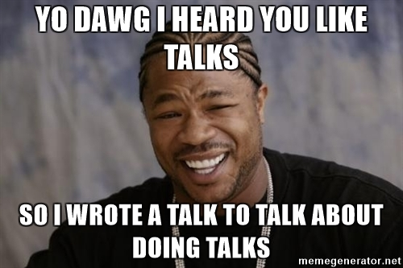
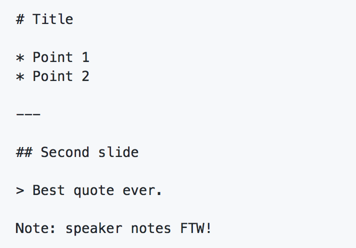

# The Talk About Talks

Sia Karamalegos
@thegreengreek

---

<!-- .slide: data-background="./camel.JPG" -->
## Or, how I travel the world by doing tech talks...

---



---

<!-- .slide: data-background="./nervous.gif" -->
## Does presenting make you feel like this?

---

<!-- .slide: data-background="./baboon.gif" -->
## Do you hate making slides?

Note: This two-part talk is for you. First, I'll talk about the strategies I use to give talks from meetups to international conferences. Then, I'll teach you a cool tool (reveal-md) for building slides super duper easily in markdown (code snippets are a breeze!).

---

## I'm afraid of talking!

- Don't calm down, get excited!<!-- .element: class="fragment" -->
- Have someone be your dedicated smiler.<!-- .element: class="fragment" -->
- Fake it until you make it.<!-- .element: class="fragment" -->
- Use confident body language.<!-- .element: class="fragment" -->
- Go to Toastmasters.<!-- .element: class="fragment" -->
- Start at local meetups or in your company.<!-- .element: class="fragment" -->

---

## I don't know what to talk about!

- In the beginning: literally almost anything.<!-- .element: class="fragment" -->
- What's a cool thing you want to learn?<!-- .element: class="fragment" -->
- What's a recent problem you had to solve?<!-- .element: class="fragment" -->
- Come to hack night and ask drunk developers for ideas.<!-- .element: class="fragment" -->
- Conferences? More on that later...<!-- .element: class="fragment" -->

Note: What was your first talk about?

---

## Conference Strategies

- Find conferences in your space: Google, ask other devs, follow influencers on Twitter
- Weasel your way into convos with organizers: volunteer, network, blog
- Be a go-getter!

---

## The CFP

- Read their CFP<!-- .element: class="fragment" -->
- Look at previous year's schedule<!-- .element: class="fragment" -->
- Apply with multiple ideas (3+)<!-- .element: class="fragment" -->

---

> **Relentlessly** focus on what you should say to convince someone to come to your talk versus the one in the next room or eating snacks in the hallway. *Sell, sell, sell!*

<small>http://www.sarahmei.com/blog/2014/04/07/what-your-conference-proposal-is-missing/</small>

---

## Writing the Presentation

- What's the story you want to tell? Outline it.<!-- .element: class="fragment" -->
- Research all the things, and fill in your outline.<!-- .element: class="fragment" -->
- Use any tool you like (PPT, Keynote, Google Slides*, Reveal)<!-- .element: class="fragment" -->
- Slides aren't your speaker notes. Enhance, don't distract.<!-- .element: class="fragment" -->

<small>* Be careful in case you don't have internet. Have offline and pdf versions as backups.</small><!-- .element: class="fragment" -->

---

# Reveal-md

reveal.js on steroids! Get beautiful reveal.js presentations from your Markdown files.

<small>https://github.com/webpro/reveal-md</small>

-v-

## Getting started

Install:

```bash
$ npm install -g reveal-md
```

Present:

```bash
$ reveal-md path/to/my/slides.md
```

-v-

## Markdown



<small>You can still use HTML and CSS when something doesn't work in Markdown!</small>

-v-

## Easy Code Snippets

Oh hey some `const="inline"` code. This `this` is the JavaScript `this`.

Maybe you need multi-line?

```javascript
function biggerCodeSnippet(myEmotions) {
  const printEmotions = myEmotions.join(', ')

  return `I feel so ${myEmotions}!`
}
```

-v-

<!-- .slide: data-background="./cookie_monster.gif" -->
## Moar Features!

-v-

## Additional Features
- Different [themes](http://lab.hakim.se/reveal-js/#/themes) and highlight themes
- Custom slide separators (horizontal and vertical)
- Custom slide attributes, like background image
- Live reload, print to pdf
- Black screen
- Speaker notes view
- Can set options in json file or using YAML front matter

-v-

<!-- .slide: data-background="./mechanic.gif" -->
## Let's take a peek under the hood

---

## Ready to get started?

- Meetups that always want new speakers: Front End Party, gnocode, NoFun
- [JazzCon.Tech](http://jazzcon.tech/) CFP is open until Nov 1!

---

<!-- .slide: data-background="./react.png" -->
<div style="color:black;">
  <h2 style="color:black;">Want to learn React and/or Redux?</h2>
  <p>https://tinyurl.com/nolareact</p>
  <p>Discount code: <strong>FRONTENDPARTY</strong></p>
</div>

---

# Thanks!

<small>Sia Karamalegos @thegreengreek</small>